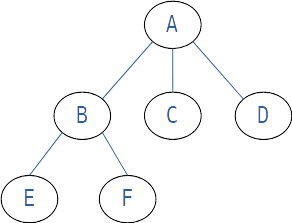
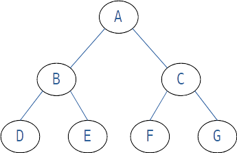
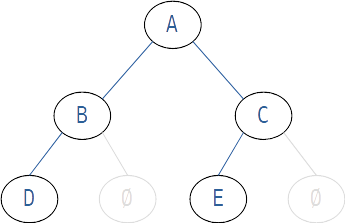
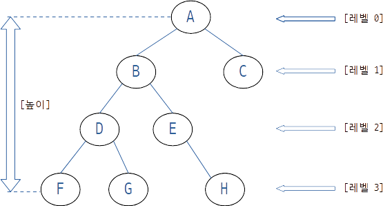
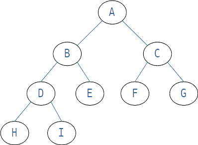

## Chapter 08 트리 (Tree)

### [08-1] 트리의 개요

#### 트리의 접근
* 트리는 계층적 관계(Hierarchical Relationship)를 표현하는 자료구조이다.
* 트리는 데이터의 저장과 삭제가 아닌 `표현`에 초점이 맞춰져 있다.
* 트리의 ADT를 바라보는 관점
  * X: 데이터의 저장, 검색 및 삭제가 용이하게 정의 되어 있는지?
  * O: 트리의 구조로 이루어진 무언가를 표현하기 위해 적절히 정의 되어있는지?

#### 트리가 표현할 수 있는 것들

* 컴퓨터의 디렉토리 구조
* 조직도
* 의사결정트리 (decision tree)

이번 장에서 트리를 이용해서 무엇인가를 저장하고 꺼내는 생각보다는 무엇인가를 표현하는 도구라는 점에 집중하자!

#### 트리 관련 용어의 소개

* 노드: node
  * 트리의 구성요소
* 간선: edge
  * 노드와 노드를 연결하는 연결선
* 루트 노드: root node
  * 트리 구조에서 최상위에 존재하는 A와 같은 노드
* 단말 노드: terminal node
  * 아래로 또 다른 노드가 연결되어 있지 않은 E, F, C, D와 같은 노드
  * Leaf노드라고도 한다.
* 내부 노드: internal node
  * 단말 노드를 제외한 모든 노드로 A, B와 같은 노드

#### 이진 트리(Binary Tree)와 서브트리(Sub Tree)

* 서브트리 (Sub Tree)

  * 큰 트리에 속하는 작은 트리

* 이진 트리 (Binary Tree)

  * 루트 노드를 중심으로 두개의 서브트리로 나뉘어진다.

  * 나뉘어진 두 서브트리도 모두 이진 트리여야한다.

  * 이진 트리

    

  * 공집합 노드가 포함된 것으로 생각하면 아래 모양의 트리도 이진 트리가 맞다.

    

  

#### 포화 이진 트리(Full Binary Tree)와 완전 이진 트리(Complete Binary Tree)

* 레벨과 높이

  

  * 레벨: 0부터 각 층별로 숫자를 매김
  * 높이: 트리의 최고레벨

* 포화 이진트리 (full binary tree)

  

  * 모든 레벨이 꽉찬 이진트리

* 완전 이진 트리 (complete binary tree)

  

  * 모든 레벨이 꽉차진 않았지만 왼쪽부터 빈틈없이 차곡차곡 채워진 이진트리
    * 노드의 순서가 위에서 아래로, 왼쪽에서 오른쪽의 순서대로 채워짐.
  * 트리의 Leaf 가 최대 높이 - 1 보다 작은 경우가 없다. 
    * 트리의 Leaf가 최대높이 -1 보다 작은 경우가 없더라도 `노드의 순서가 왼쪽부터 채워진 경우가 아니라면 완전 이진 트리가 아니다.`

### [08-2] 이진 트리의 구현

### [08-3] 이진 트리의 순회(Traversal)

#### 문제 08-1 \[이진 트리의 소멸\]

### [08-4] 수식 트리(Expression Tree)의 구현

#### 문제 08-2 \[중위 표기법의 소괄호\]

### **정오표**
* 

### 기타

* Stack around the variable '변수명' was corrupted.
  * 이런식의 오류가 날때.. 뭔가 배열의 인덱스 범위를 초과하게 코드를 잘못 작성했는지 확인해보자. 
* 확인이 필요한 다이어그램에 대해서 LibreOffice Draw로 그리는데, odg파일도 Git저장소에 포함시킨다.
  * 8장 다이어그램 모음 odg 파일 
    * [chapter-08-diagram.odg](doc-resources/chapter-08-diagram.odg) 

* 다이어그램 이미지의 모든 글꼴은 네이버 `D2Coding`으로 사용한다.

