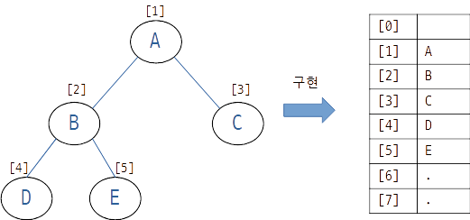

## Chapter 08 트리 (Tree)

### [08-1] 트리의 개요

#### 트리의 접근
* 트리는 계층적 관계(Hierarchical Relationship)를 표현하는 자료구조이다.
* 트리는 데이터의 저장과 삭제가 아닌 `표현`에 초점이 맞춰져 있다.
* 트리의 ADT를 바라보는 관점
  * X: 데이터의 저장, 검색 및 삭제가 용이하게 정의 되어 있는지?
  * O: 트리의 구조로 이루어진 무언가를 표현하기 위해 적절히 정의 되어있는지?

#### 트리가 표현할 수 있는 것들

* 컴퓨터의 디렉토리 구조
* 조직도
* 의사결정트리 (decision tree)

이번 장에서 트리를 이용해서 무엇인가를 저장하고 꺼내는 생각보다는 무엇인가를 표현하는 도구라는 점에 집중하자!


#### 트리 관련 용어의 소개


* 노드: node
  * 트리의 구성요소
* 간선: edge
  * 노드와 노드를 연결하는 연결선
* 루트 노드: root node
  * 트리 구조에서 최상위에 존재하는 A와 같은 노드
* 단말 노드: terminal node
  * 아래로 또 다른 노드가 연결되어 있지 않은 E, F, C, D와 같은 노드
  * Leaf노드라고도 한다.
* 내부 노드: internal node
  * 단말 노드를 제외한 모든 노드로 A, B와 같은 노드

#### 이진 트리(Binary Tree)와 서브트리(Sub Tree)

* 서브트리 (Sub Tree)

  * 큰 트리에 속하는 작은 트리

* 이진 트리 (Binary Tree)

  * 루트 노드를 중심으로 두개의 서브트리로 나뉘어진다.

  * 나뉘어진 두 서브트리도 모두 이진 트리여야한다.

  * 이진 트리

    

  * 공집합 노드가 포함된 것으로 생각하면 아래 모양의 트리도 이진 트리가 맞다.

    

  

#### 포화 이진 트리(Full Binary Tree)와 완전 이진 트리(Complete Binary Tree)

* 레벨과 높이

  

  * 레벨: 0부터 각 층별로 숫자를 매김
  * 높이: 트리의 최고레벨

* 포화 이진트리 (full binary tree)

  

  * 모든 레벨이 꽉찬 이진트리

* 완전 이진 트리 (complete binary tree)

  

  * 모든 레벨이 꽉차진 않았지만 왼쪽부터 빈틈없이 차곡차곡 채워진 이진트리
    * 노드의 순서가 위에서 아래로, 왼쪽에서 오른쪽의 순서대로 채워짐.
  * 트리의 Leaf 가 최대 높이 - 1 보다 작은 경우가 없다. 
    * 트리의 Leaf가 최대높이 -1 보다 작은 경우가 없더라도 `노드의 순서가 왼쪽부터 채워진 경우가 아니라면 완전 이진 트리가 아니다.`


### [08-2] 이진 트리의 구현

#### 이진 트리의 구현 방법: 배열기반 or 연결리스트 기반

* 연결리스트

  * 트리를 표현하기에 유연함

* 배열기반

  

  * 트리가 완성된 이후 부터는 그 트리를 대상으로 매우 빈번한 탐색이 이루어질 때는 배열기반으로 고려해볼만함
  * 그러고보니.. 콘도우 저자님 책에서 힙 정렬을 할 때, 탐색 트리를 만들어서 정렬했었다.
    * Chapter 16.  힙 소트
      * https://github.com/fp024/java-programmer-no-tameno-algorithm-to-data-kouzou/tree/master/src/main/java/org/fp024/study/algorithm/part04/chapter16
  * 노드 번호가 부여된 이진 트리
  * 배열의 인덱스가 0인 부분은 사용하지 않음
    * 구현의 편의
    * 오류 발생 최소화

* 연결리스트 기반

  


#### 헤더 파일에 정의된 구조체 이해 ~ 이진트리의 구현

* 프로젝트
  * BinaryTreeLibrary
    * 재귀적인 free()시에 순회를 어떻게 할지 고려해야하는데, 이부분은 바로 다음 파트에서 논의
  * BinaryTreeMain

### [08-3] 이진 트리의 순회(Traversal)

#### 순회의 3가지 방법

* 전위 순회 (Preorder Traversal) : 루트 노드를 먼저!  (번호는 노드 방문순서)

  ```
           1
         /  \
       2     3
  ```

* 중위 순회 (Inorder Traversal) : 루트 노드를 중간에!

  ```
           2
         /  \
       1     3
  ```

* 후위 순회 (Postorder Traversal) : 루트노드를 마지막에!

  ```
           3
         /  \
       1     2
  ```

  

#### 순회의 재귀적 표현	

* 중위 순회
  1. 왼쪽 서브트리의 순회
  2. 루트 노드의 방문
  3. 오른쪽 서브트리의 순회

* 소스참조: BinaryTreeMain.c


#### 노드의 방문 이유! 자유롭게 구성하기

* InorderTraverse에 함수 포인터를 인자로 받게하여 어떤식으로 방문할지의 방법을 전달한다.
* 프로젝트
  * BinaryTree2Library
  * BinaryTree2Main

#### 문제 08-1 \[이진 트리의 소멸\]

* 프로젝트
  * BinaryTree2Library, BinaryTree2Main 에 덧붙여서 진행


### [08-4] 수식 트리(Expression Tree)의 구현

#### 수식 트리의 이해

* 수식

  * `7 + 4 * 2 - 1`

* 수식 트리

  

  

* 수식 트리 연산방법
  * 루트 노드에 저장된 연산자의 연산을 하되, 두 개의 자식 노드에 저장된 두 피 연산자를 대상으로 연산을 한다.


 * 수식트리 활용
    * 중위 표기법 수식 -> 후위 표기법 수식 -> 수식트리
      	* 중위 표기법을 바로 수식트리로 전환하기는 복잡하고 힘듬, 후위 표기법으로 변환한뒤, 수식트리로 만듦.


#### 수식 트리의 구현에 필요한 도구와 헤더파일의 정의

* 프로젝트
  * 6장의 
  * BinaryTree2Library
  * ExpressionTreeLibrary
    * <?> 프로젝트를 정적 라이브러리로 지정하면 따로 링크가 뜨진 않네..?
      * 라이브러리 관리자라는 항목이 새로 있다. 여기서 `추가 종속성`하고 `추가 라이브러리 디렉터리`를 지정하면 될 것 같다.
  * ExpressionTreeMain


#### 후위 표기법의 수식을 기반으로 수식트리 구성하기

* `1 2 + 7 *` 의 수식 트리

  

  * 특징
    * 연산 순서대로 왼쪽에서 오른쪽으로 연산자가 나열됨
    * 해당 연산자의 두 피연산자는 연산자 앞에 나열됨
    * 먼저 등장하는 피연산자와 연산자를 이용해 트리 하단을 만들고, 이를 바탕으로 점진적으로 트리 윗부분을 구성해 나아가야함.
  * ExpressionTreeLibrary의 Expression.c 파일의 MakeExpTree()

#### 수식 트리의 순회

* BinaryTree2Library프로젝트에서 정의한 함수를 활용한다.

  * PreorderTraverse(), InorderTraverse(), PostorderTraverse()

* TODO:

  * 스택에 넣을 요소(Data 타입)가 `BTreeNode*` 가 되어서 6장에서 구현했던 프로젝트를 그대로 사용할 수 없다.

    * 6장에서 구현시 Data의 타입이 int여서 뭔가 제네릭처럼 처리를 할 수 있어야하는데, 그부분이 안되어있어, 스택 소스는 해당 프로젝트에 포함시키고 typedef 만 재정의 했다. <br>

      `typedef BTreeNode* Data;`  


#### 문제 08-2 \[중위 표기법의 소괄호\]

* 현재 방문 노드가 연산자 노드일 때 괄호로 감싸주면 됨
* 현재 방문노드가 연산자 노드인지의 판별은 좌우 어느 한쪽은 반드시 있어야한다는 것이 고려되면 될 것 같다.
  * 이항연산자만 써서 연산자 노드라면 왼쪽/오른쪽 자식 모두 있어야할 것으로 판단할 수 있지만... 지금은 고려하지 않더라도 단항연산자도 있으므로... 왼쪽 오른쪽 둘중 하나라도 NULL이 아닐 때, 연산자로 간주했다.

    ```c
    /**
     * 문제 08
     * 중위 표기법에 소괄호 넣기  관련 함수 수정
     */
    void InorderTraverseForEx08(BTreeNode* bt, VisitFuncPtr action) {
        if (bt == NULL) {
            return;
        }
    
        // 현재 방문노드가 연산자 노드일때만 괄호 열고 닫게 하는 식으로 했다.
        if (GetLeftSubTree(bt) != NULL || GetRightSubTree(bt) != NULL) {
            printf("( ");
        }
    
        InorderTraverseForEx08(GetLeftSubTree(bt), action);
        action(GetData(bt));
        InorderTraverseForEx08(GetRightSubTree(bt), action);
    
        if (GetLeftSubTree(bt) != NULL || GetRightSubTree(bt) != NULL) {
            printf(" )");
        }
    }
    
    ```


#### 수식 트리의 계산


### **정오표**
* 

### 기타

* Stack around the variable '변수명' was corrupted.
  * 이런식의 오류가 날때.. 뭔가 배열의 인덱스 범위를 초과하게 코드를 잘못 작성했는지 확인해보자. 
* 확인이 필요한 다이어그램에 대해서 LibreOffice Draw로 그리는데, odg파일도 Git저장소에 포함시킨다.
  * 8장 다이어그램 모음 odg 파일 
    * [chapter-08-diagram.odg](doc-resources/chapter-08-diagram.odg) 
* 다이어그램 이미지의 모든 글꼴은 네이버 `D2Coding`으로 사용한다.
* Visual Studio에서 이미지 들을 커밋하면 경로를 바꿔주는 것 같다. 커밋 할 때 옵션을 봐야겠다. Source Tree로 커밋할 때는 경로가 바뀌는 일은 없었음..
  * `https://github.com/{username}/{repository_name}/blob/master/ChapterXXX/이미지파일`
  * 이미지를 blob/{branch} 명에 몰아서 두는게 맞는거 같기도 한데.. 일단은 push는 SourceTree로 하자

* typedef로 함수 포인터 별칭 정의하기
  * https://dojang.io/mod/page/view.php?id=601

