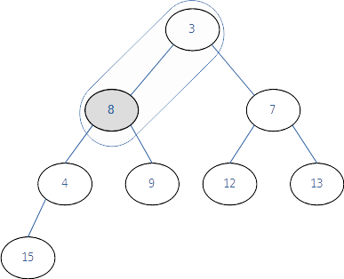

## Chapter 09 우선순위 큐(Priority Queue)와 힙(Heap) 

### [09-1] 우선순위 큐의 이해
#### 우선수위 큐와 우선순위의 이해

* 큐의 핵심 연산
  * enqueue : 큐에 데이터를 삽입하는 행위
  * dequeue : 큐에서 데이터를 꺼내는 행위
* 우선순위 큐의 핵심연산
  * enqueue : 우선순위 큐에 데이터를 삽입하는 행위
  * dequeue: 우선순위 큐에서 데이터를 꺼내는 행위

* 우선순위 큐의 연산결과
  * 들어간 순서에 상관없이 우선순위가 높은 데이터가 먼저 나옴.

#### 우선순위 큐의 구현 방법

* 구현 방법
  1. 배열을 기반으로 구현하는 방법
     * 데이터의 우선순위가 높을 수록 배열의 앞쪽에 데이터를 위치 시킴
     * 데이터를 삽입 및 삭제하는 과정에서 데이터를 한칸씩 뒤로 밀거나 한칸씩 앞으로 당기는 연산이 수반됨.
     * 삽입 위치를 찾기 위해 배열에 저장된 모든 데이터와 우선순위 비교를 진행해야할 수도 있음.
  2. 연결 리스트를 기반으로 구현하는 방법
     * 배열 처럼 삽입 삭제과정에서 데이터를 한칸씩 뒤로 밀거나 당기는 연산은 필요없음.
     * 삽입의 위치를 찾기위해 모든 데이터와 비교해야하는 연산은 배열과 마찬가지로 진행해야할 수도 있음.
  3. 힙(heap)을 이용하는 방법
     * 1. 배열, 2. 연결리스트 이용시의 단점 극복을 위해 우선순위 큐 구현시는 힙을 이용함.


#### 힙(Heap)의 소개

* 힙은 `이진 트리`이되 `완전 이진 트리`이다. 그리고 모든 노드에 저장된 값은 자식 노드에 저장된  값보다 크거나 같아야한다. 즉 루트 노드에 저장된 값이 가장 커야한다.

* 최대 힙 (max heap)

  * 루트 노드로 올라갈수록 저장된 값이 커지는 완전 이진트리

    

* 최소 힙 (min heap)

  * 루트 노드로 올라갈수록 저장된 값이 작아지는 완전 이진트리

    

* 루트 노드에 우선 순위가 가장 높은 데이터를 위치시킬 수 있는 특성을 이용하여 우선순위 큐를 쉽게 구현할 수 있다.

* 힙(heap) : 무엇인가를 차곡차곡 쌓아올린 더미


### [09-2] 힙의 구현과 우선순위 큐의 완성
#### 힙에서의 데이터 저장과정

* 최소 힙을 기준으로 함.

1. 데이터 추가 직전의 힙

   * 자식 노드 데이터의 우선순위 <= 부모 노드 데이터의 순위

   

   

2. 데이터 추가의 과정 1/3

   * 새로운 데이터는 우선순위가 가장 낮다는 가정하에 `마지막 위치`에 저장

   

3. 데이터 추가의 과정 2/3

   * 부모와 우선순위를 비교해가며 자신을 위치를 찾을 때까지 비교 해가며 위치 변경

   

4. 데이터 추가의 과정 3/3

   * 새로 입력한 노드가 제자리를 찾음

   


#### 힙에서의 데이터 삭제과정

1. 루트 노드를 일단 삭제

   * 우선순위 큐에서의 삭제는 `가장 우선순위의 데이터 삭제`를 의미함.

     

   

2. 빈 공간을 채우는 과정 1/3

   * 마지막 노드를 루트에 위치 시킨다.

     

3. 빈 공간을 채우는 과정 2/3

   * 자식 노드들중 우선순위가 높은 노드와 부모의 위치를 변경시킨다.

     

4. 빈 공간을 채우는 과정 3/3

   * 제 위치를 찾았다.

     


#### 삽입과 삭제의 과정에서 보인 성능의 평가

우선순위 큐의 구현에 있어서 단순 배열이나 연결 리스트보다 힙이 더 적합한 이유는?

* 배열
  * 배열 기반 데이터 저장의 시간 복잡도: O(n)
  * 배열 기반 데이터 삭제의 시간 복잡도: O(1)
    * 배열의 내용을 한칸씩 앞으로 미는 연산도 포함되지 않았는지?

* 연결리스트
  * 연결 리스트 기반 데이터 저장의 시간 복잡도: O(n)
  * 연결 리스트 기반 데이터 삭제의 시간 복잡도: O(1)
* 힙
  * 힙 기반 데이터 저장의 시간 복잡도: O(log<sub>2</sub>n)
  * 힙 기반 데이터 삭제의 시간 복잡도: O(log<sub>2</sub>n)

> 힙을 기반으로 하면 트리의 높이에 해당하는 수만큼만 비교 연산을 진행하면 된다.

#### 힙의 구현에 어울리는 것은 연결 리스트? 아니면 배열?

> 연결리스트를 기반으로 힙을 구현하면, 새로운 노드를 힙의 `마지막 위치`에 추가하는 것이 쉽지않다.


* 연결리스트를 사용했을 때.. 완전 이진트리에서 마지막 노드의 위치를 어떻게 찾기 힘들것 같긴하다. ㅠㅠ

  

#### 배열을 기반으로 힙을 구현하는데 필요한 지식들

> 노드에 고유의 번호를 부여한다. 그리고 그 번호가 각 노드의 데이터가 저장 될 배열의 인덱스 값이 된다.

* 배열 기반 이진 트리

  

  

* 노드의 인덱스를 얻는 방법

  * 왼쪽 자식노드

    * 부모노드의 인덱스 값 * 2

  * 오른쪽 자식노드

    * 부모노드의 인덱스 값 * 2 + 1

  * 부모노드

    * 자식 노드의 인덱스 값 / 2  `(정수 나눗셈)`

      

#### 원리 이해 중심의 힙 구현: 헤더파일의 소개

* 프로젝트
  * SimpleHeapLibrary
    * SimpleHeap.h

#### 원리 이해 중심의 힙 구현: HDelete 함수에 대한 설명 중심으로

* 프로젝트

  * SimpleHeapLibrary
    * SimpleHeap.c - HDelete()

  

#### 원리 이해 중심의 힙 구현: HInsert 함수에 대한 설명 중심으로

* 프로젝트
  * SimpleHeapLibrary
    * SimpleHeap.c - HInsert()

#### 완성된 힙의 실행을 위한 main함수! 그리고 반성!

* 프로젝트

  * SimpleHeapMain

* 반성

  * 데이터를 입력하기 전에 우선순위를 결정하고 그값을 전달해줘야하는점

    ```c
    void HInsert(Heap* ph, HData data, Priority pr); // 데이터에 우선순위 정보까지 함께 넘김
    ```

  * 우선순위라는 것이 데이터를 기준으로 결정되는 것이 대부분인데... 무언가 문제가 있다.

#### 제법 쓸만한 수준의 힙 구현: 힙의 변경

* 프로젝트 
  * EnhancedHeapLibrary

* 우선순위 비교 기준 함수를 함수 포인터로 라이브러리 사용자가 전달해서 사용

  * 첫번째 인자의 우선순위가 높으면, 0보다 큰값이 반환
  * 두번째 인자의 우선순위가 높으면, 0보다 작은 값이 반환
  * 첫번째, 두번째 우선순위가 같다면 0 을 반환

  ```c
  typedef int PriorityComp(HData d1, HData d2);
  ```

  

* Heap 구조체 변경 - 우선순위 판단의 기준을 힙에 설정할 수 있도록 함.

  ```c
  typedef struct _heap {
  	PriorityComp* comp;         // typedef int (*PriorityComp)(HData d1, HData d2);
      int numOfData;
      HData heapArr[HEAP_LEN];	// typedef char HData;
  }
  ```


#### 제법 쓸만한 수준의 힙 구현: 힙의 변경사항 완성하기

* 프로젝트 

  * EnhancedHeapLibrary

  * EnhancedHeapMain

    

#### 제법 쓸만한 수준의 힙을 이용한 우선순위 큐의 구현


### **정오표**

* p363  typedef 와 _heap 구조체의 함수 포인터 선언부의 포인터 지정이 잘못됨

  * 동영상 강의에서는 `typedef int PriorityComp(HData d1, HData d2);` 와 같이 사용하여 문제가 없는데, 교제가 수정이 안되어 있는 것 같다.

      ```c
      // typedef에서 함수포인터 타입으로 지정했는데.. 구조체에서 포인터를 또 붙임
      // Visual Studio 2019에서는 아래 오류로 노출됨..
      //   "C++ 명백한 호출의 괄호 앞에 오는 식에는 함수 (포인터) 형식이 있어야 합니다"
      typedef int (*PriorityComp)(HData d1, HData d2);
      
      typedef struct _heap {
        PriorityComp* comp;
        // ...
      }
      
      // ==>
      typedef struct _heap {
        PriorityComp comp;  // 포인터를 빼야함.         
        // ...
      }
      
      // ===================================================================================
      // typedef에서 함수 포인터 타입으로 지정하지 않는다면, 아래 내용은 정상임.
      typedef int PriorityComp(HData d1, HData d2);
      
      typedef struct _heap {
        PriorityComp* comp;
        // ...
      }
      ```

    

### 기타

* 
