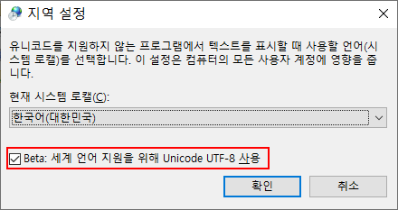

## 윤성우의 열혈 자료구조 스터디 - VS 2019
### Visual Studio 2019 를 사용하여 진행

Visual Studio 2019에서 Git을 어떻게 사용하나 궁금해서, 프로젝트 생성해봄.

### 프로젝트 생성
1. 솔루션으로 introduction-to-data-structures-using-c 를 일단 만듬.
2. 솔루션 이하에 장(Chapter)별로 폴더 만듬.
3. 하나의 장에서는 main 함수 기준으로는 별도 프로젝트로 만들어야 진행이 간편해보임  
    * 빌드는 개별 프로젝트 별로 빌드하면 될 것 같다.
4. gitignore는 레포지토리 생성시 자동으로 잘 만들어짐


#### VS 플러그인 설치
* Markdown Editor
  * https://marketplace.visualstudio.com/items?itemName=MadsKristensen.MarkdownEditor
* SonarLint for Visual Studio 2019 (추후 설치)
  * Java 였다면 대부분 룰을 알고 있기 때문에, 제안이 도움이 되는데, C의 경우는 처음부터 룰의 메시지들이 많이나오다보면 해깔릴 수 있어 나중에 설치하자!
  * https://marketplace.visualstudio.com/items?itemName=SonarSource.SonarLintforVisualStudio2019

#### VS 단축키
* 이름 바꾸기
  * Ctrl + R, Ctrl + R
* 코드 포멧팅
  * Ctrl + K, Ctrl + D(전체) 또는 F(선택부분)
* 한 줄 주석
  * Ctrl + K, Ctrl + C
* 여러줄 주석 (주석영역에서 다시 눌러 취소 가능)
  * Ctrl + Shift + /
* 주석 취소
  * Ctrl + K, Ctrl + U

#### 소스파일 UTF-8 BOM
* 새로운 *.c, *.cpp, *.h 를 추가할 때, 한글이 들어가면 EUC-KR로 저장이 되는 문제가 있었는데,  
  아래처럼 기본 템플릿 파일에 미리 한글을 넣고 UTF-8 BOM으로 저장하면 UTF-8 BOM 형식 파일을 유지할 수 있었다. 
  
* Visual Studio 2019 Community 설치 경로
  * .\Community\Common7\IDE\VC\VCProjectItems
    * newc++file.cpp
    ```c
    /**
     * 새로운 C/C++ 소스 파일
     */
    ```
    * hfile.h
     ```c
    /**
     * 새로운 C/C++ 헤더 파일
     */
    #pragma once
    
     ```

* BOM이 붙은 UTF-8을 소스파일로 사용한 이유는, 프로젝트를 기본으로 생성하는 환경에서는 BOM이 안붙으면 이 소스가 UTF-8 소스인지 Visual Studio가 인식을 못하는 것 같다.

* BOM이 붙지않은 UTF-8 소스를 빌드할 때, 아래 경고가 노출됨
  * `warning C4819: 현재 코드 페이지(949)에서 표시할 수 없는 문자가 파일에 들어 있습니다. 데이터가 손실되지 않게 하려면 해당 파일을 유니코드 형식으로 저장하십시오.`
    * 컴파일러 추가 옵션에 `/utf-8`을 넣어주면 위의 경고는 나타나지 않는데... 일단 옵션은 넣지 말고, BOM 붙여서 쓰자. 
      * https://docs.microsoft.com/ko-kr/cpp/build/reference/utf-8-set-source-and-executable-character-sets-to-utf-8?view=msvc-160
  
* Windows 10에서의 **[Beta: 세계 언어 지원을 위해 Unicode UTF-8 사용]** 옵션

  

  한글 Windows 10에서 전에는 못보던 옵션이 보이는데... 저것을 체크하면 <br>

  * 명령프롬프트(CMD), PowerShell 모두 chcp로 확인시 기본 65001 코드 페이지가 되었다.

  * 소스 코드을 UTF-8 또는 UTF-8 BOM 인코딩 형식으로 저장했다면 별도로 /utf-8 컴파일러 옵션을 주지 않아도 UTF-8로 인식해서 경고/에러 없이 빌드가  잘 된다.

    * 65001 코드 페이지의 CMD나 PowerShell에서 한글 출력이나 scanf를 통한 입력도 잘 된다.
    * 이전에는 단순하게 chcp 65001 명령어로 코드 페이지 바꾸는 것 만으로 한글 출력에는 문제가 없었지만 **scanf 같은 입력함수는 한글이 깨졌었음.**
    * Windows 10 환경에서는 이 옵션 켜 두고 써도 괜찮을 것 같다.

  * 명령 프롬프트 기본 환경이 UTF-8이여서, VSCode에 GCC옵션으로 설정한  아래 옵션은 필요없어진 것 같다.

    ```
    "-finput-charset=UTF-8",
    "-fexec-charset=CP949",
    ```

    

#### 정적 라이브러리 만들기
* 라이브러리 프로젝트 
  * 빈 프로젝트로 만든다음에 구성 형식만 애플리케이션에서 lib으로 변경
    * 구성속성 -> 일반 -> 구성형식
      * 애플리케이션(.exe) -> 정적라이브러리(.lib)

* 라이브러리 사용처 프로젝트 설정
  * 해당 라이브러리의 헤더를 사용하기 위해 프로젝트의 추가 포함 디렉토리에서 아래와 같은 식으로 지정
    * 구성속성 -> C/C++ -> 추가포함디렉토리
      * `$(SolutionDir)\Chapter04\DLinkedListLibrary`
  * 링커 설정에서 lib파일 추가
    * 구성속성 -> 링커 -> 입력
      * `$(SolutionDir)Chapter04\$(Platform)\$(Configuration)\DLinkedListLibrary.lib`

* 라이브러리 사용처 프로젝트 빌드 전에, 라이브러리 프로젝트가 먼저 빌드될 필요가 있음.
  * 솔루션 선택상태에서 오른쪽 메뉴를 열어 프로젝트 종속성을 설정한다. 
    * 라이브러리 사용처 프로젝트가 라이브러리 프로젝트에 종속 되도록 설정.


#### 동적 라이브러리 만들기
* 연습: 자체 동적 연결 라이브러리 만들기 및 사용(C++)
  * 이 내용은 좀 더 알아야 진행이 될 것 같다.
  * https://docs.microsoft.com/ko-kr/cpp/build/walkthrough-creating-and-using-a-dynamic-link-library-cpp?view=msvc-160
* 단순하게 빈프로젝트에서 DLL 생성하는 식으로는 사용이 안되었음.
* C++ 기반이라서 잘 안되는 것 같다. ㅠㅠ
  * C++에 익숙해서 코드 자체를 C++용으로 만들어야 원할할 것 같음.


#### 출력디렉토리 변경
실행파일이 솔루션 루트에 공통적으로 생성되어, 챕터별로 나누기 위해 아래처럼 설정을 변경
* 구성속성 -> 일반 -> 출력 디렉토리
  * `$(SolutionDir)Chapter04\$(Platform)\$(Configuration)\`

#### 기타
* 확장자를 cpp에서 c로 바꿀 것
  * 프로젝트를 신규 생성하다보면 기본 추가되는 파일이 cpp인데, cpp확장자를 유지하면서 c로 빌드한 정적 라이브러리를 빌드하면 링크에러가 난다.  
    => 확장자를 꼭 바꿔주도록 하자!

* Windows 8.1 에서 `Microsoft Visual Stduio 디버그 콘솔`의 글꼴을 바꾸고 싶을 때...
  * 프로그램 좌상단 아이콘 클릭후 `Defaults` 에 있는 부분과 `Properties` 를  열어 모두 동일하게 글꼴을 바꿔준다.

* Markdown 확장기능의 탭크기 변경
  * `[도구]`->`[옵션]`->`[텍스트편집기]`->`[Markdown]`->`[탭]`->`탭크기, 들여쓰기크기 값 변경`


#### MinGW-GCC로 수행하던 GitHub 프로젝트
* Visual Studio Code + MinGW GCC로 진행하던 프로젝트
  * https://github.com/fp024/introduction-to-data-structures-using-c-by-yoon
* 특정 챕터를 왔다갔다 진행하면서 해도될 것 같다.
  * GCC 빌드를 위한 배치파일 만드는 것이나, Visual Studio 2019 프로그램에서 설정을 해서 빌드하는 것이나 둘다 해봐도 나쁘진 않은 것 같다.
