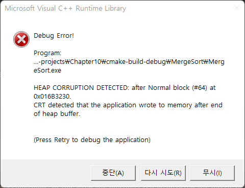

# Chapter 10 정렬(Sorting)

## 10-1 단순한 정렬 알고리즘

### 버블 정렬(Bubble Sort): 이해와 구현

* 정렬 순위가 가장 낮은, 제일 큰 값을 맨 뒤로 보내기

### 버블 정렬(Bubble Sort): 성능 평가

* 비교 횟수가 등차수열로 나타남
  * ( n - 1) + ( n - 2 ) + ... + 2 + 1
  * n ( n - 1 ) / 2 = ( n<sup>2</sup> - n ) / 2 => O( n<sup>2</sup> )

### 선택 정렬(Selection Sort): 이해와 구현

* 정렬 순서상 가장 앞서는 것을 선택해서 가장 왼쪽으로 이동
* 원래 그 자리에 있던 데이터는 빈자리에 둠.

### 선택 정렬(Selection Sort): 성능 평가

* 비교 횟수 기준으로 보면 버블정렬과 같다. => ( n - 1) + ( n - 2 ) + ... + 2 + 1 => O( n<sup>2</sup> )

* 대입연산을 바깥쪽 for문에 둬서 대입 횟수를 줄일 수도 있지만, 버블정렬은 최선의 경우(정렬된 경우)라면 대입연산이 한번도 일어나지 않는다.

* 버블이나 선택이나 우열을 가리는 것에는 의미가 없음.

  

### 삽입 정렬(Insertion Sort): 이해와 구현

* 삽입할 위치를 발견하고 데이터를 한칸씩 뒤로 밀기
* 데이터를 한칸씩 뒤로 밀면서 삽입위치 찾기

### 삽입 정렬(Insertion Sort): 성능 평가

* 정렬 대상 대부분이 이미 정렬되어있는 경우 매우 빠르게 동작

* 최악의 경우라면 내부루프에서 항상 대입연산이 일어나므로 O(n<sup>2</sup>) 이다.

  


## 10-2 복잡하지만 효율적인 정렬 알고리즘

### 힙 정렬(Heap Sort): 이해와 구현

* 힙의 특성
  * 힙의 루트 노드에 저장된 값이 가장 우선순위가 크다.
  * 힙의 루트 노드에 저장됨 값이 정렬 순서상 가장 앞선다.

### 힙 정렬(Heap Sort): 성능 평가

* 삽입 삭제에 대한 시간 복잡도 => O(2log<sub>2</sub>n) => O(log<sub>2</sub>n)
  * 힙 데이터 저장 시간 복잡도
    * O(log<sub>2</sub>n)
  * 힙 데이터 삭제 시간 복잡도
    * O(log<sub>2</sub>n)
* n개를 정렬하는 과정과 함깨 생각할 때.
  * O(nlog<sub>2</sub>n)


### 병합 정렬(Merge Sort): 이해와 구현

* 분할 정복 기법 3단계
  1. 분할 (Divide) : 해결이 용이한 단계까지 문제를 분할해 나감
  2. 정복 (Conquer): 해결이 용이한 단계까지 문제를 해결
  3. 결합 (Combine): 분할해서 해결한 결과를 결합해서 마무리 한다.

* 분할을 어디까지 할까?  

  데이터가 2개가 아닌 1개가 남을 때까지 진행

* 분할의 과정에서 하나씩 구분이 될 때까지 둘로 나누는 과정을 반복하는 이유?  

  재귀적 처리를 위해


### 병합 정렬(Merge Sort): 성능 평가

* 비교 연산 관점
  * 정렬의 대상이 데이터 수가 n개 일 때, 각 병합으 ㅣ단계마다 최대 n번의 비교연산이 진행됨
    * O(nlog<sub>2</sub>n)

* 데이터 이동 관점
  * 비교연산 횟수의 두배에 해당하는 이동연산 발생
    * 임시배열에서 데이터를 병합하는 과정에서 한번
    * 임시배열에서 저장된 데이터를 전부 원위치로 옮기는 과정에서 한번
  * O(2nlog<sub>2</sub>n) -> O(nlog<sub>2</sub>n)

* 배열 정렬시 임시 메모리가 필요하다는 단점이 있으나 연결리스트일 경우 단점이 되지 않음.


### 퀵 정렬(Quick Sort): 이해와 구현


### 퀵 정렬(Quick Sort): 성능 평가


### 기수 정렬(Radix Sort): 이해1


### 기수 정렬(Radix Sort): 이해2


### 기수 정렬(Radix Sort): LSD vs MSD


### 기수 정렬(Radix Sort): LSD 기준 구현


### 기수 정렬(Radix Sort): 성능평가


## 기타

### 나의 오타로 인한 HEAP CORRUPTION DETECTED 오류



Ubuntu환경 GCC 나, Cygwin 등에서는 실제로 문제가 있는 코드가 있었지만 오류 메시지가 나타나지 않았었는데, Visual Studio 환경으로 선택시 위와 같은 오류가 발생했다.

```c
/* MergeSort.c 코드 일부 */
// 문제를 발생 시키는 부분
int *sortArr = (int *) malloc(sizeof(int) * right + 1);
(...)
// 오류 발생 부분
free(sortArr);


// 수정 코드
int *sortArr = (int *) malloc(sizeof(int) * (right + 1));

```

힙 버퍼의 끝 이후에 메모리 쓰기가 감지 되었다는 메시지 관련해서...

**최초에 malloc으로 int 크기만큼 배수로 생성해야하는데,  괄호를 제대로 안붙여서, 마지막 요소가 1바이트만큼만 붙여진 상태에서 만들어졌다.** 그런데 디버깅을 진행하면서 볼 때, 직접 쓰는 시점에서는 오류가 바로 발생하지 않고, 메모리 해제(free)시에 발생이 된 것 같다.  

